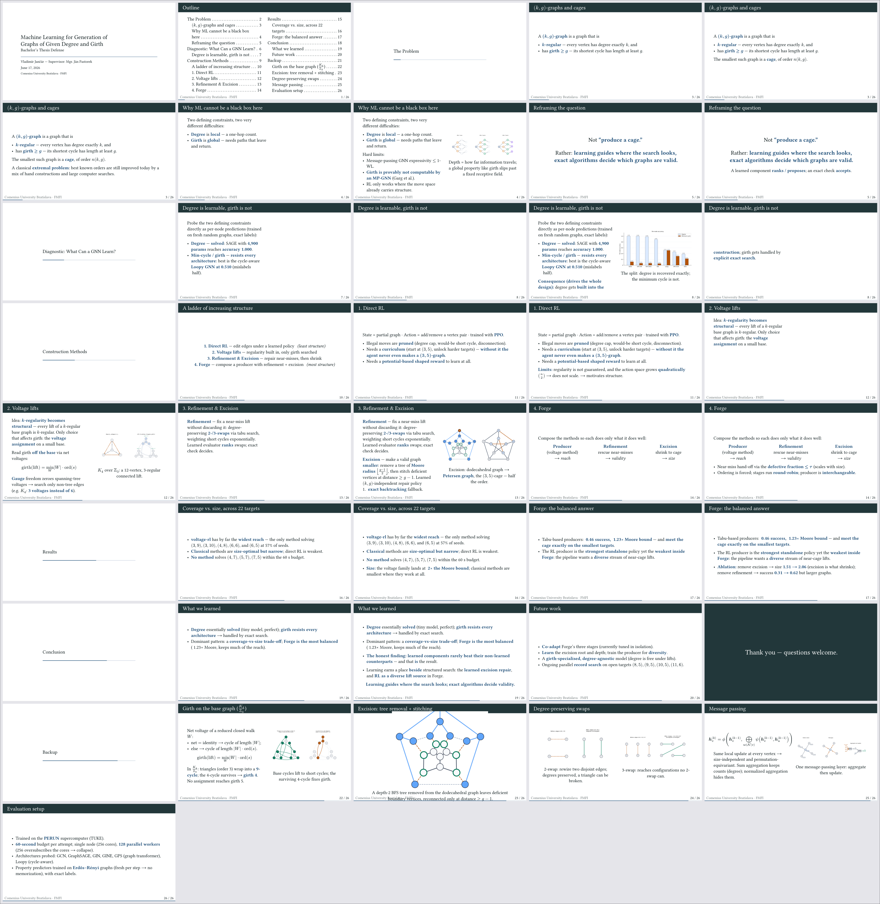
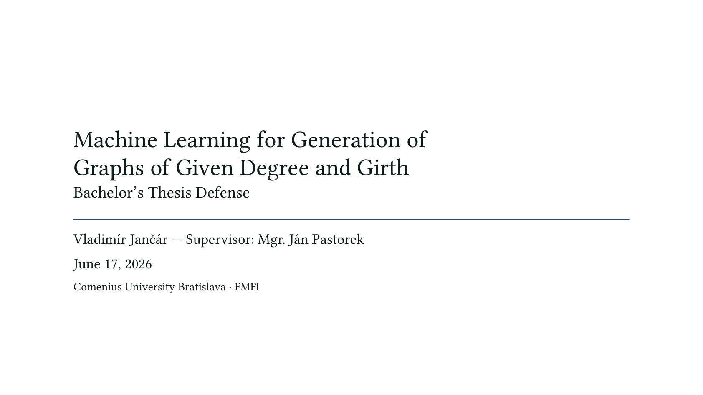
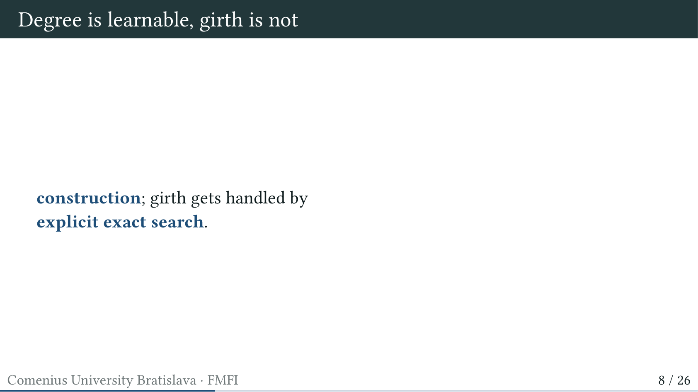
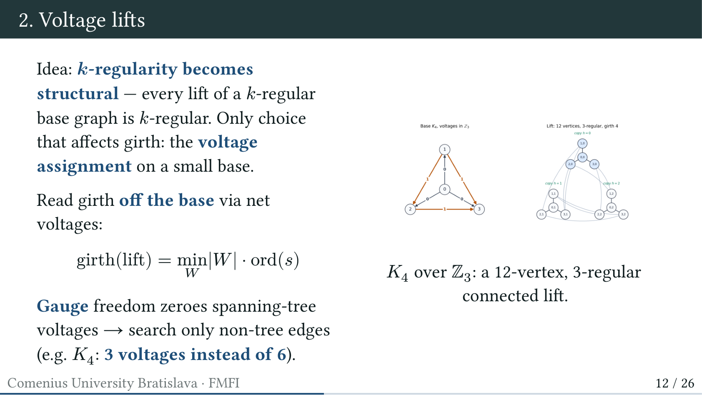
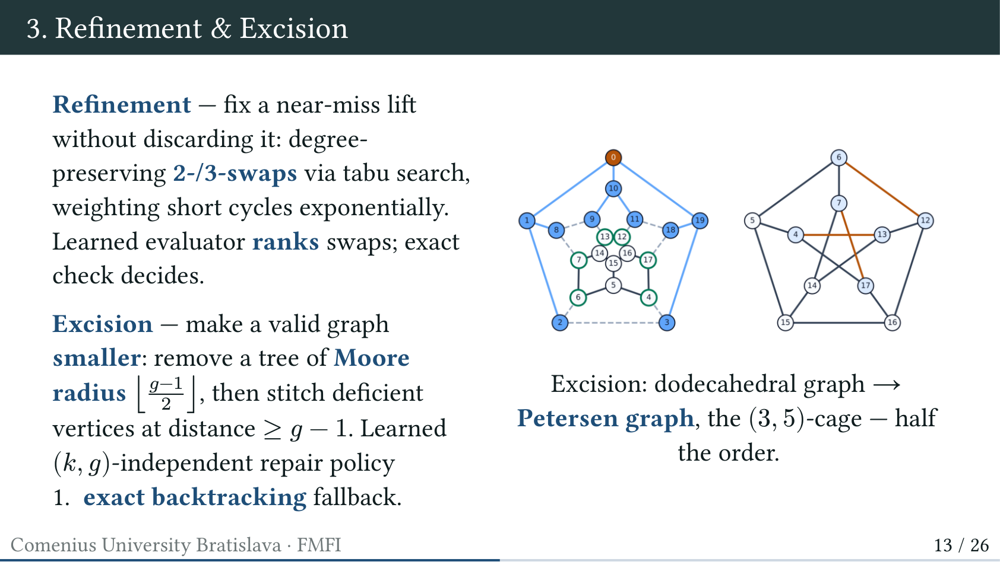
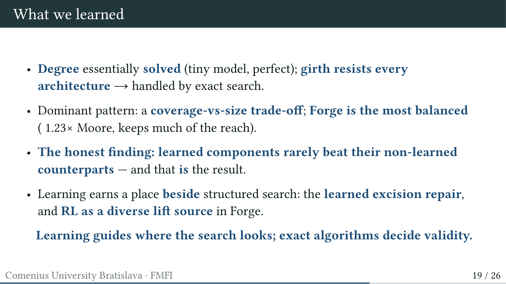

# 📱 Presentation Preview

Mobile-friendly preview of the 12-minute defense deck. The real source is
[`slides.typ`](slides.typ); the compiled PDF is [`slides.pdf`](slides.pdf).
Outline + timing is in [`outline.md`](outline.md).

> Tip: tap any image to zoom. To leave feedback, comment on the pull request and
> tell me which slide number to change.

---

## All slides at a glance

---

## Key slides (full size)

### Title

### Diagnostic — degree is learnable, girth is not

### Voltage lifts

### Refinement & Excision (dodecahedron → Petersen)

### Conclusion

---

## Slide order (logical slides)

1. Title
2. Outline
3. *(k,g)*-graphs and cages — the problem
4. Why ML cannot be a black box (girth not GNN-computable)
5. Reframing: learning guides, exact decides
6. Diagnostic: degree learnable, girth not
7. A ladder of increasing structure
8. Direct RL
9. Voltage lifts
10. Refinement & Excision
11. Forge
12. Results: coverage vs. size (22 targets)
13. Forge results + ablation
14. Conclusion
15. Future work + Thank you
16. Backup slides (girth-on-base, excision detail, swaps, message passing, eval setup)

See [`outline.md`](outline.md) for the per-slide time budget (~12 min) and the
anticipated committee questions.
